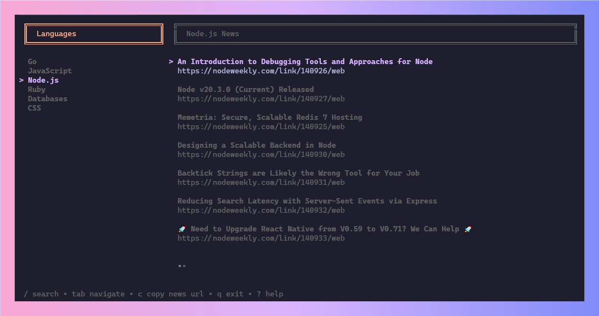

  

## 📦 Built With

- [Bubbletea](https://github.com/charmbracelet/bubbletea)
- [Bubbles](https://github.com/charmbracelet/bubbles)
- [Lipgloss](https://github.com/charmbracelet/lipgloss)
- [Colly](https://github.com/gocolly/colly)

## ⌨️ Key Bindings

| Action                              | Key                            |
| :---------------------------------- | :----------------------------- |
| Copy selected news URL to clipboard | <kbd>c</kbd>                   |
| Move down in a list                 | <kbd>j</kbd>                   |
| Move up in a list                   | <kbd>k</kbd>                   |
| Move to the top of a list           | <kbd>g</kbd>                   |
| Move to the bottom of a list        | <kbd>G</kbd>                   |
| Move to next tab                    | <kbd>tab</kbd>                 |
| Move to previous tab                | <kbd>shift+tab</kbd>           |
| Search / Filter news by title       | <kbd>/</kbd>                   |
| Toggle help                         | <kbd>?</kbd>                   |
| Quit application                    | <kbd>q</kbd> <kbd>ctrl+c</kbd> |

## ✅ Todo

- [x] Implement copy to clipboard functionality.
- [x] Add more languages to the list.
- [x] Open selected news in the browser.

## 📝 License

[MIT](https://github.com/moaqz/news/blob/master/LICENSE)

## ❓ Acknowledgments

Inspired by [Atticus64/news](https://github.com/Atticus64/news)
